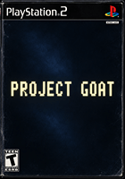

# Project Goat - Goat Format Simulator for PS2

Project Ignis / EDOPRO / YGOCORE brought to the PlayStation 2 

## Features

- Full goat format cards, ban list
- 79 CPUs to fight, progressing through tiers
- 27 packs to unlock
- Deck editor
